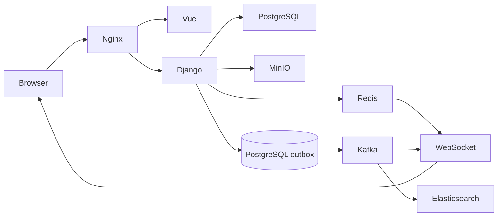

# ThreadFlow

ThreadFlow is a Vue and Django SPA for scalable threaded comments. PostgreSQL is the source of truth; the application is delivered in vertical milestones so the synchronous comment path stays usable while asynchronous infrastructure is added.

## Implementation status

The release candidate implements:

- guest root comments and replies;
- UUID users and comments;
- `parent_id`, `root_id` and `depth` tree representation;
- cursor pagination over 25 root comments;
- root sorting by date, author name or email in both directions;
- bounded tree responses without N+1 queries;
- Vue comment form, recursive reply UI and focused inline reply composer;
- PostgreSQL migrations, unified API errors and health check;
- Docker images for Django, Vue and Nginx;
- provisioned PostgreSQL 17 and Redis Server 8.10;
- backend API tests, Ruff and Pyright configuration;
- JWT registration, login, refresh, logout and current-user flows;
- httpOnly authentication cookies with CSRF protection and refresh rotation;
- Pinia authentication state without JavaScript-accessible JWTs;
- automated backend/frontend quality gates in pre-commit and GitHub Actions;
- Redis-backed CAPTCHA required for every root and reply;
- Redis-backed write throttling for comment creation;
- validated and sanitized comment HTML limited to safe formatting tags;
- typed WebSocket commands and live `comment.created` delivery through Redis;
- automatic reconnect, REST resynchronization and REST write fallback;
- compact modal authentication and deterministic guest avatars;
- persisted `Auto`, light and dark color themes;
- private MinIO/S3-compatible image and TXT attachments with content-based MIME checks;
- proportional 320×240 image resizing, safe TXT delivery and optional account avatars;
- transactional PostgreSQL outbox with acknowledged Kafka publication;
- independent, idempotent search and WebSocket consumer groups, retry and DLQ topics;
- Elasticsearch fuzzy full-text search, highlighting, date/author filters and PostgreSQL fallback;
- bulk Elasticsearch index rebuild tooling with PostgreSQL as the source of truth;
- comment up/down voting with per-identity deduplication and live `comment.voted` updates;
- prefix-aware paginated search with author/date filters, sorting and jump-to-comment;
- sign in with either a username or an email address;
- inline attach control and UTF-8-safe attachment delivery for non-ASCII file names;
- server-rendered sanitized comment preview with a compact formatting toolbar;
- Prometheus metrics for HTTP, comments, votes, search and the event pipeline;
- read-only GraphQL trees with request-scoped batching and query limits;
- Redis-cached comment pages with write-safe namespace invalidation;
- incremental root pagination, lazy branch expansion and safe in-app TXT previews;
- Playwright browser coverage and k6 API/WebSocket load profiles;
- bulk seed tooling verified with 1,000,000 comments and 10,000 users.

Redis serves CAPTCHA, write rate limiting, popular-page caching, the Channels layer and the owner-checked outbox publisher lease.

## Architecture



Command paths are `Browser → Nginx → REST/WebSocket → Django → PostgreSQL`. Committed domain events travel through the outbox and Kafka; separate consumers update Elasticsearch and fan live events through Channels. Uploaded bytes stay in private MinIO/S3-compatible storage.

## Technology choices

- Django 6.1 and Django REST Framework 3.18 provide the HTTP API and ORM.
- Vue 3, TypeScript, Vite and Pinia provide the SPA.
- PostgreSQL stores authoritative relational data.
- Redis Server 8.10 is reserved for ephemeral data and coordination, never primary comments.
- `uv` owns Python dependency resolution and the committed lockfile.
- Uvicorn serves Django ASGI for both HTTP and WebSocket traffic.
- Channels with a Redis channel layer provides public live comment delivery and reconnect-safe REST resynchronization.
- Kafka 4.3 provides the durable event log; consumer groups distribute each projection independently.
- Elasticsearch 9.4 provides the rebuildable search projection and PostgreSQL provides fallback reads.
- MinIO provides the local private S3-compatible object store; AWS S3 can use the same storage adapter.
- Prometheus scrapes the web process and each background consumer independently.
- Strawberry GraphQL exposes selection-based, batched read access without duplicating commands.
- Nginx exposes one public endpoint and routes `/api/` to Django.

## Repository layout

```text
backend/          Django project, applications, migrations and tests
frontend/         Vue SPA
docker/           Application, Prometheus, Playwright and k6 images/configuration
docs/api/         Human-readable REST contracts and usage notes
docs/architecture/ Database and event-flow diagrams
docs/realtime/    WebSocket operations, event registry and delivery semantics
docs/testing/     Measured load-test results
load-tests/       k6 API and WebSocket profiles and preparation guide
docker-compose.yml
pyproject.toml
uv.lock
```

## Run with Docker

Requirements: Docker with Compose support.

```bash
cp .env.example .env
docker compose --env-file .env up --build
```

Add `-d` to keep the stack in the background. The `.env` file is required and is not committed (it is gitignored), so this copy step is mandatory: `.env.example` is the tracked template and Compose reads the resulting `.env` from the project directory. The defaults run locally as-is; replace every `change-me` secret before exposing the application outside a local machine.

The single Compose command builds the SPA and API, waits for PostgreSQL, Redis, Kafka, Elasticsearch and MinIO, applies migrations, creates Kafka topics and object-storage resources, rebuilds the search index, creates the optional demo account, and starts all consumers plus Prometheus.

The template creates the local demonstration account `demo` / `demo-password`. These credentials are intentionally local-only and must be changed or disabled before exposing the stack.

### Local service map

| What | URL or access | What to inspect |
| --- | --- | --- |
| ThreadFlow SPA | `http://localhost:8080` | Comments, auth, themes, live replies, files and search |
| Swagger UI | `http://localhost:8080/api/docs` | Interactive REST contract |
| ReDoc | `http://localhost:8080/api/redoc` | Readable REST reference |
| OpenAPI | `http://localhost:8080/api/schema` | Generated machine-readable schema |
| GraphQL | `http://localhost:8080/graphql` | Read-only branch queries; no browser IDE is exposed |
| Prometheus | `http://localhost:9090` | Metrics queries; `/targets` shows the API and three consumers |
| MinIO console | `http://localhost:9101` | Private attachment bucket; use `MINIO_ROOT_*` credentials |
| MinIO API | `http://localhost:9100` | Local S3-compatible endpoint |
| PostgreSQL | `localhost:5433` | Source-of-truth database using `POSTGRES_*` credentials |
| Redis | `localhost:6380` | Ephemeral cache/channel state using `REDIS_PASSWORD` |

Kafka and Elasticsearch are intentionally private to the Compose network. Inspect them without exposing extra ports:

```bash
docker compose --env-file .env exec kafka \
  /opt/kafka/bin/kafka-topics.sh --bootstrap-server localhost:9092 --list
docker compose --env-file .env exec elasticsearch \
  curl -s 'http://localhost:9200/threadflow-comments-v1/_search?size=3&pretty'
```

### What to try

Open the SPA and post as a guest or use `demo` / `demo-password`. CAPTCHA is required for every comment. Registration and sign-in live in the top-right dialog. `Reply` opens a focused form directly below the selected comment; submitted roots, replies and votes appear live through WebSocket events. The editor supports preview and the allowed safe HTML tags, while JPG/PNG/GIF images and UTF-8 TXT files can be attached and previewed safely.

Search demonstrates the Elasticsearch projection and transparently falls back to PostgreSQL when Elasticsearch is unavailable. A compact GraphQL read example is:

```bash
curl -G http://localhost:8080/graphql \
  --data-urlencode 'query={ rootComments(first: 3, depth: 2) { id author { name } replies { id text } } }'
```

In Prometheus, open `/targets` to confirm four healthy scrape targets, then query metrics such as `threadflow_http_requests_total`, `threadflow_comments_created_total`, `threadflow_events_published_total` and `threadflow_events_processed_total`. Kafka topic purposes and delivery guarantees are documented in [`docs/architecture/events.md`](docs/architecture/events.md); GraphQL fields are documented in [`docs/api/graphql.md`](docs/api/graphql.md); the WebSocket command/event registry is in [`docs/realtime/websocket.md`](docs/realtime/websocket.md).

Stop the stack without deleting persistent volumes:

```bash
docker compose --env-file .env down
```

`APP_ENV=development` supports local HTTP. For HTTPS deployment use `APP_ENV=production`, enable secure cookies and configure public hosts and trusted origins.

## Environment configuration

`.env.example` is grouped by runtime, Django, PostgreSQL, Redis, authentication, Kafka, Elasticsearch, object storage, WebSocket and observability. `.env` is local-only and ignored by Git.

| Variable | Purpose |
| --- | --- |
| `APP_ENV` | Selects development or production security defaults |
| `DJANGO_SECRET_KEY` | Django cryptographic signing key |
| `DJANGO_ALLOWED_HOSTS` | Accepted HTTP host names |
| `POSTGRES_*` | PostgreSQL database and connection settings |
| `REDIS_IMAGE` | Redis Server container version |
| `REDIS_PASSWORD` | Redis authentication password |
| `RATE_LIMIT_*` | Comment and vote write limits |
| `KAFKA_*` | Broker, topic, retry and outbox settings |
| `ELASTICSEARCH_*` | Search endpoint, index and timeouts |
| `S3_*`, `MINIO_*` | Private object-storage connection and credentials |
| `DEMO_USER_*` | Optional local demo-user bootstrap |
| `PROMETHEUS_*`, `METRICS_PORT` | Metrics image, UI port and consumer exporter port |

## REST API

Interactive and machine-readable documentation:

- Swagger UI: `http://localhost:8080/api/docs`;
- ReDoc: `http://localhost:8080/api/redoc`;
- OpenAPI schema: `http://localhost:8080/api/schema`;
- human-readable API index: [`docs/api/README.md`](docs/api/README.md).

| Method | Path | Purpose |
| --- | --- | --- |
| `GET` | `/api/health` | Service health |
| `GET` | `/api/auth/csrf` | Initialize the CSRF cookie |
| `POST` | `/api/auth/register` | Register and set JWT cookies |
| `POST` | `/api/auth/login` | Sign in and set JWT cookies |
| `POST` | `/api/auth/refresh` | Rotate JWT cookies |
| `POST` | `/api/auth/logout` | Expire JWT cookies |
| `GET` | `/api/auth/me` | Return the current user |
| `GET` | `/api/captcha` | Create a short-lived CAPTCHA challenge |
| `GET` | `/api/comments` | Cursor-paginated root comments and branches |
| `POST` | `/api/comments` | Create a root comment |
| `GET` | `/api/comments/{id}` | Read one branch |
| `POST` | `/api/comments/{id}/replies` | Reply to a comment |
| `POST` | `/api/comments/{id}/vote` | Up/down vote a comment (`value` is `1`, `-1` or `0`) |
| `POST` | `/api/attachments` | Validate and upload an attachment or avatar |
| `GET` | `/api/attachments/{id}/content` | Safely serve stored content |
| `GET` | `/api/search` | Search comments with PostgreSQL fallback |
| `POST`, `GET` | `/graphql` | Read-only batched comment-tree queries |

Live comment commands and events use `ws://localhost:8080/ws/comments`; `comment.created` and `comment.voted` are pushed to subscribers. An expired or invalid token degrades to a guest connection instead of dropping the socket. See [`docs/realtime/websocket.md`](docs/realtime/websocket.md) for the typed contract and event registry.

List parameters:

- `sort=date|name|email`;
- `direction=asc|desc`;
- `cursor=<opaque cursor>`;
- `depth=0..10`, default `2`.

Replies for the selected roots are loaded in one additional query and assembled in memory. `has_more_replies` marks branches truncated by the requested depth.

Guest comment example:

```json
{
  "username": "Alice1",
  "email": "alice@example.com",
  "homepage": "https://example.com",
  "text": "Hello, <strong>ThreadFlow</strong>",
  "captcha_id": "bd452430-f18d-4f5f-a933-18fc48ed2f2b",
  "captcha_answer": "A7K9P2"
}
```

Validation errors use one envelope:

```json
{
  "error": {
    "code": "invalid",
    "details": {}
  }
}
```

## Local development

Python dependencies are managed with `uv`; pip requirements files are not used.

```bash
uv sync --group test --group lint
uv run --group test python backend/manage.py check
uv run --group test python backend/manage.py makemigrations --check --dry-run
uv run --group test python backend/manage.py spectacular --validate
uv run --group test pytest
uv run --group lint ruff check backend
uv run --group lint ruff format --check .
uv run --group lint pyright
uv run --group test pytest --cov
uv run --group security pip-audit
```

Install the repository hooks once with `uv run --group lint pre-commit install --install-hooks`.
Fast lint, format and type checks run before commits; the backend test suite runs before pushes.
GitHub Actions repeats backend and frontend quality gates for pull requests and protected branches.

Frontend checks:

```bash
cd frontend
npm ci
npm run build
npm test
```

Backend coverage is enforced at 85%. The current complete suite contains 74 tests and reports 88.01% branch-aware coverage. Browser and load-test commands are documented in [`load-tests/README.md`](load-tests/README.md); measured results are recorded in [`docs/testing/load-test-results.md`](docs/testing/load-test-results.md).

Run the real browser journey against the Compose stack with one-use CAPTCHA credentials:

```bash
credentials=$(docker compose --env-file .env run --rm backend \
  python manage.py prepare_load_captchas --count 8 | tail -n 1)
E2E_CAPTCHAS="$credentials" docker compose --env-file .env --profile e2e \
  run --rm playwright
```

## Data model

Comments use an adjacency list plus denormalized branch metadata:

- `parent_id` identifies the direct parent;
- `root_id` groups a complete branch;
- `depth` avoids recalculating nesting depth;
- author name and email are immutable snapshots independent of the user account.

Root comments are cursor-paginated. Compound indexes support stable ordering by date, author name and author email, using the UUID as the tie-breaker.

Each comment keeps a denormalized `score`; `CommentVote` records one vote per identity (`user:<pk>` or `guest:<ip>`) so a single voter cannot inflate a comment.

`Attachment` stores object metadata while bytes live in MinIO/S3. `OutboxEvent` is written with the aggregate transaction; `ProcessedEvent` is unique per event and consumer. See [`docs/architecture/events.md`](docs/architecture/events.md).



Mermaid source: [`docs/architecture/db-schema.mmd`](docs/architecture/db-schema.mmd). [`docs/architecture/schema.sql`](docs/architecture/schema.sql) is the authoritative PostgreSQL DDL. [`docs/architecture/schema.mysql.sql`](docs/architecture/schema.mysql.sql) mirrors the domain schema in MySQL 8 syntax for import into MySQL Workbench.

## Git workflow

- `main` contains reviewed, working milestones.
- feature work starts from `develop` in short-lived `feature/*` branches when useful.
- pull requests target `main` and follow `.github/pull_request_template.md`.
- commits use imperative present-tense subjects.
- pushing and merging are explicit operations; local work is never pushed automatically.

## Remaining delivery work

The repository implementation, automated tests and local release tooling are complete. Public deployment and the demonstration video are intentionally left to the final delivery environment.

The attachment milestone also adds optional account avatars stored in object storage. Guest comments use locally generated initial avatars so visitor email addresses are never sent to an external avatar service. Final visual polish follows the functional milestones and keeps the comment feed compact, avatar-led and focused on live discussion.

## MVP limitations

- guest vote deduplication is keyed on client IP, so guests behind one NAT share a vote;
- refresh-token reuse is not yet tracked server-side;
- retry backoff blocks the affected consumer partition; a dedicated delayed-retry scheduler is deferred;
- orphaned pending object cleanup is not scheduled yet;
- large branches are bounded by response depth and expanded lazily rather than returned without a limit;
- the repository does not include a public deployment URL or demonstration video.
