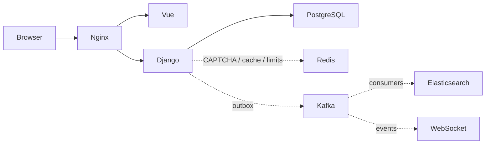

# ThreadFlow

ThreadFlow is a Vue and Django SPA for scalable threaded comments. PostgreSQL is the source of truth; the application is delivered in vertical milestones so the synchronous comment path stays usable while asynchronous infrastructure is added.

## Milestone status

The foundation milestone is implemented:

- guest root comments and replies;
- UUID users and comments;
- `parent_id`, `root_id` and `depth` tree representation;
- cursor pagination over 25 root comments;
- root sorting by date, author name or email in both directions;
- bounded tree responses without N+1 queries;
- Vue comment form, list and recursive reply UI;
- PostgreSQL migrations, unified API errors and health check;
- Docker images for Django, Vue and Nginx;
- provisioned PostgreSQL 17 and Redis Server 8.10;
- backend API tests, Ruff and Pyright configuration.
- JWT registration, login, refresh, logout and current-user flows;
- httpOnly authentication cookies with CSRF protection and refresh rotation;
- Pinia authentication state without JavaScript-accessible JWTs;
- automated backend/frontend quality gates in pre-commit and GitHub Actions.
- Redis-backed CAPTCHA required for every root and reply;
- Redis-backed write throttling for comment creation;
- validated and sanitized comment HTML limited to safe formatting tags.

Kafka, Elasticsearch, GraphQL, Prometheus, Channels and object storage are locked dependencies for later milestones. Their application integrations are not implemented yet. Redis currently serves CAPTCHA and comment rate limiting; page caching and refresh-token revocation remain later work.

## Architecture



Current request path: `Browser → Nginx → Vue/Django → PostgreSQL`. Dashed integrations belong to later milestones.

## Technology choices

- Django 6.1 and Django REST Framework 3.18 provide the HTTP API and ORM.
- Vue 3, TypeScript, Vite and Pinia provide the SPA.
- PostgreSQL stores authoritative relational data.
- Redis Server 8.10 is reserved for ephemeral data and coordination, never primary comments.
- `uv` owns Python dependency resolution and the committed lockfile.
- Uvicorn serves Django ASGI so WebSocket support can be introduced without replacing the runtime.
- Nginx exposes one public endpoint and routes `/api/` to Django.

## Repository layout

```text
backend/          Django project, applications, migrations and tests
frontend/         Vue SPA
docker/           Backend, frontend and Nginx container definitions
docs/api/         Human-readable REST contracts and usage notes
load-tests/       k6 scenarios added after search and WebSocket implementation
docker-compose.yml
pyproject.toml
uv.lock
```

## Run with Docker

Requirements: Docker with Compose support.

```bash
cp .env.example .env
docker compose --env-file .env up --build
```

Replace every `change-me` value before exposing the application outside a local machine. Open `http://localhost:8080`. Startup applies migrations and optionally creates the demo account configured by `DEMO_USER_*`; guest comments do not require authentication.

Stop the stack without deleting PostgreSQL or Redis volumes:

```bash
docker compose --env-file .env down
```

`APP_ENV=development` supports local HTTP. For HTTPS deployment use `APP_ENV=production`, enable secure cookies and configure public hosts and trusted origins.

## Environment configuration

`.env.example` is grouped by runtime, Django, PostgreSQL, Redis, authentication, Kafka, Elasticsearch, object storage, WebSocket and observability. `.env` is local-only and ignored by Git.

| Variable | Purpose |
| --- | --- |
| `APP_ENV` | Selects development or production security defaults |
| `DJANGO_SECRET_KEY` | Django cryptographic signing key |
| `DJANGO_ALLOWED_HOSTS` | Accepted HTTP host names |
| `POSTGRES_*` | PostgreSQL database and connection settings |
| `REDIS_IMAGE` | Redis Server container version |
| `REDIS_PASSWORD` | Redis authentication password |
| `DEMO_USER_*` | Optional local demo-user bootstrap |

## REST API

Interactive and machine-readable documentation:

- Swagger UI: `http://localhost:8080/api/docs`;
- ReDoc: `http://localhost:8080/api/redoc`;
- OpenAPI schema: `http://localhost:8080/api/schema`;
- human-readable API index: [`docs/api/README.md`](docs/api/README.md).

| Method | Path | Purpose |
| --- | --- | --- |
| `GET` | `/api/health` | Service health |
| `GET` | `/api/auth/csrf` | Initialize the CSRF cookie |
| `POST` | `/api/auth/register` | Register and set JWT cookies |
| `POST` | `/api/auth/login` | Sign in and set JWT cookies |
| `POST` | `/api/auth/refresh` | Rotate JWT cookies |
| `POST` | `/api/auth/logout` | Expire JWT cookies |
| `GET` | `/api/auth/me` | Return the current user |
| `GET` | `/api/captcha` | Create a short-lived CAPTCHA challenge |
| `GET` | `/api/comments` | Cursor-paginated root comments and branches |
| `POST` | `/api/comments` | Create a root comment |
| `GET` | `/api/comments/{id}` | Read one branch |
| `POST` | `/api/comments/{id}/replies` | Reply to a comment |

List parameters:

- `sort=date|name|email`;
- `direction=asc|desc`;
- `cursor=<opaque cursor>`;
- `depth=0..10`, default `2`.

Replies for the selected roots are loaded in one additional query and assembled in memory. `has_more_replies` marks branches truncated by the requested depth.

Guest comment example:

```json
{
  "username": "Alice1",
  "email": "alice@example.com",
  "homepage": "https://example.com",
  "text": "Hello, <strong>ThreadFlow</strong>",
  "captcha_id": "bd452430-f18d-4f5f-a933-18fc48ed2f2b",
  "captcha_answer": "A7K9P2"
}
```

Validation errors use one envelope:

```json
{
  "error": {
    "code": "invalid",
    "details": {}
  }
}
```

## Local development

Python dependencies are managed with `uv`; pip requirements files are not used.

```bash
uv sync --group test --group lint
uv run --group test python backend/manage.py check
uv run --group test python backend/manage.py makemigrations --check --dry-run
uv run --group test python backend/manage.py spectacular --validate
uv run --group test pytest
uv run --group lint ruff check backend
uv run --group lint ruff format --check .
uv run --group lint pyright
uv run --group test pytest --cov
uv run --group security pip-audit
```

Install the repository hooks once with `uv run --group lint pre-commit install --install-hooks`.
Fast lint, format and type checks run before commits; the backend test suite runs before pushes.
GitHub Actions repeats backend and frontend quality gates for pull requests and protected branches.

Frontend checks:

```bash
cd frontend
npm ci
npm run build
npm test
```

## Data model

Comments use an adjacency list plus denormalized branch metadata:

- `parent_id` identifies the direct parent;
- `root_id` groups a complete branch;
- `depth` avoids recalculating nesting depth;
- author name and email are immutable snapshots independent of the user account.

Root comments are cursor-paginated. Compound indexes support stable ordering by date, author name and author email, using the UUID as the tie-breaker.

## Git workflow

- `main` contains reviewed, working milestones.
- feature work starts from `develop` in short-lived `feature/*` branches when useful.
- pull requests target `main` and follow `.github/pull_request_template.md`.
- commits use imperative present-tense subjects.
- pushing and merging are explicit operations; local work is never pushed automatically.

## Roadmap

1. Typed WebSocket transport for live comment commands and events, retaining REST fallback.
2. image and TXT attachments backed by MinIO/S3-compatible storage.
3. transactional outbox, Kafka consumers, retry topics and DLQ feeding WebSocket delivery.
4. Elasticsearch indexing, fallback and rebuild tooling.
5. read-only GraphQL with batching and complexity limits.
6. Prometheus metrics, k6 load profiles and deployment documentation.

The attachment milestone also adds optional account avatars stored in object storage. Guest comments use locally generated initial avatars so visitor email addresses are never sent to an external avatar service. Final visual polish follows the functional milestones and keeps the comment feed compact, avatar-led and focused on live discussion.

## MVP limitations

- refresh-token reuse is not yet tracked server-side;
- attachments, search and realtime updates are unavailable;
- large branches are bounded by response depth, but reply pagination is not implemented yet;
- production deployment and load-test results are not available yet.
